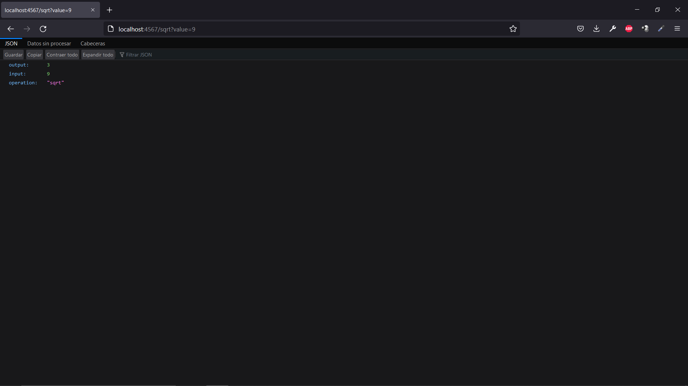
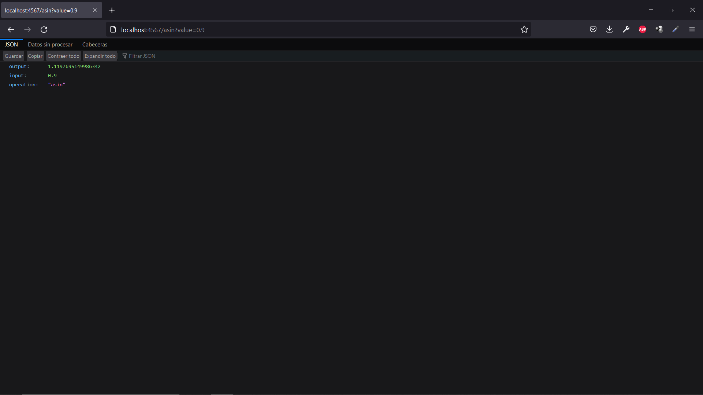

# mathapp

Implementa las funciones de raiz cuadrada y arcoseno

## Funcionamiento ⚙️





<figure class="video_container">
  <video controls="true" allowfullscreen="true" poster="./files/EC2.png">
    <source src="./files/EC2.mp4" type="video/mp4">
  </video>
</figure>

## Despliegue 📦

#####Pagina del deploy => [mathapp](http://ec2-54-211-47-204.compute-1.amazonaws.com:42000)

#####Clonado
```
git clone https://github.com/J-382/AREP-P2 
```

#####Compilado y ejecucion
```
mvn clean install
mvn compile
java -cp "./classes:./dependency/*" edu.eci.arep.App
```

#####EC2
```
sudo yum update -y
sudo yum install docker
sudo service docker start
docker run -d -p 42000:6000 --name firstdockerimageaws j382/mathapp
```
## Construido con 🛠️

* [Maven](https://maven.apache.org/) - Manejador de dependencias
* [Spark](https://www.zingchart.com/) - Framework para desarrollo de aplicaciones web

## Autores ✒️

* **Jose Perez** - *Codificacion y diseño* - [J382](https://github.com/J-382)

## Licencia 📄

Este proyecto está bajo la Licencia [GNU](https://www.gnu.org/licenses/gpl-3.0.html)
